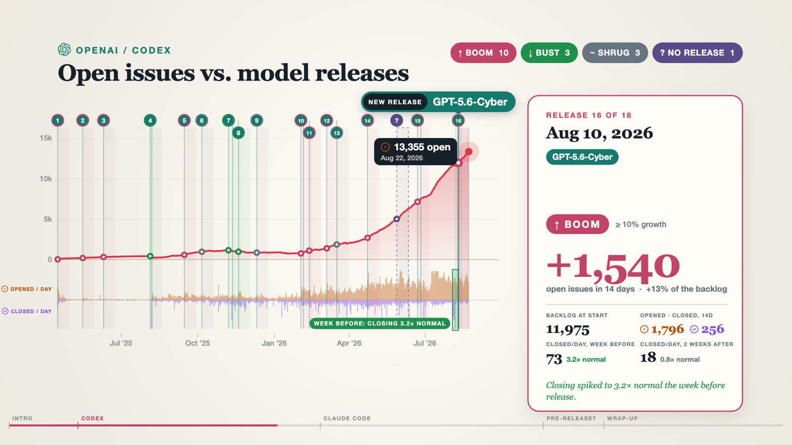

# Issue with AI

**Does a new AI model make its own coding agent's bug tracker better or worse?**

OpenAI and Anthropic ship new models every few weeks. Both labs also run public GitHub issue trackers for their coding agents: [`openai/codex`](https://github.com/openai/codex/issues) and [`anthropics/claude-code`](https://github.com/anthropics/claude-code/issues). This project lines up 52 model and product releases against every issue ever filed in those two repos. For each release, it checks what happened to the backlog of open issues over the next two weeks.

**Live site: <https://movy.github.io/issue-with-ai/>**

[](https://movy.github.io/issue-with-ai/#film)

<sub>▶ Click the poster to watch the film on the site ([MP4](media/issue-with-ai.mp4)).</sub>

The result is a static site with a 2:20 data film, a short list of findings and an interactive chart for each repo. Everything comes from one committed snapshot of the GitHub data. The page never calls GitHub at runtime.

## What we found

Numbers are from the September 28, 2026 snapshot. The site recomputes them from whatever snapshot is committed.

- **On average, a release fortnight looks like any other.** Codex's backlog grew by 10% or more in the 14 days after 59% of releases. That happens in 63% of all 14-day stretches anyway. For Claude Code the figures are 43% vs 54%.
- **The extremes sit right next to launches.** Codex's biggest 14-day jump (+2,544 open issues) started the day GPT-6 Astra shipped. Claude Code's biggest 14-day drop (−3,026) started two days before Fable 5.1 and Mythos 5.1.
- **Some big swings had no release anywhere near them.** For example, Claude Code went down 2,084 from Dec 29 with no release within five weeks.
- **No sign of a quiet cleanup before launches.** In the week before a release, the median closing rate was 0.98× normal for Codex and 0.95× for Claude Code. There are a few exceptions: GPT-5.6-Cyber (3.2×), Opus 4.8 (2.1×) and Sonnet 4.6 (1.7×).
- **Closing capacity is what separates the two.** In the last 30 days Codex closed 14 issues for every 100 opened. Claude Code closed 125.

This is correlation, not causation. The data can't tell a bot clean-up from human triage, and it doesn't know why an issue was closed.

## Methodology

**Issue data.** `scripts/collect-github-data.mjs` downloads every issue in both repos through the GitHub GraphQL API (pull requests excluded). It then groups them into daily counts of opened and closed issues by UTC calendar date. "Open issues" on a given day is the end-of-day backlog, rebuilt from the full history. Up to five issues per day with 25+ comments are kept for the chart tooltips.

**Releases.** `data/events.json` lists OpenAI and Anthropic releases from [AI Release Tracker](https://aireleasetracker.com/) and official announcements. Each release is tied to the repo of the lab that shipped it. Releases less than 7 days apart are grouped into one "release moment", measured from the first date. That gives 18 moments for Codex and 15 for Claude Code.

**The 14-day test.** For each moment we compare the open-issue count on release day with the count 14 days later, as a share of the release-day backlog:

| Verdict | Rule |
|---|---|
| Boom | backlog grew by 10% or more |
| Bust | backlog shrank by 5% or more |
| Shrug | anything in between |

The most recent releases have less than 14 days of data. They're measured over the days available, and the site shows how many.

**Base rate.** To see whether releases stand out, we apply the same 14-day test to every day in each repo, skipping each tracker's first month.

**Closing before a launch.** For each release: issues closed per day in the 7 days before, divided by the closing rate 8–35 days before. 1.0× means business as usual. We report the median across releases, and flag releases at 1.5× or more.

**Swings with no release.** These are 14-day windows where the backlog moved by 20% or more (and by at least 500 issues), with no release in the three weeks before the window or during it. We keep the two largest per repo.

## Run it locally

```sh
npm run collect   # needs GITHUB_TOKEN in the environment or .env
npm run check     # validates data/snapshot.json
npm run dev       # serves the site at http://localhost:4173
```

The collector needs a GitHub token because it uses authenticated GraphQL cursor pagination to fetch complete histories. It records the collection time in the snapshot.

## Publish

`.github/workflows/deploy-pages.yml` validates the snapshot, copies only the site files (`index.html`, `app.js`, `styles.css`, `data/`, `media/`) into `_site/` and publishes that to GitHub Pages. In the repo settings, set Pages → Build and deployment → Source to **GitHub Actions**. The site redeploys whenever one of those files changes. You can also run the workflow by hand from the Actions tab.

## The film

The film was made with [brag](https://github.com/latent-spaces/brag), a Claude Code skill that turns a project into a launch video. `media/issue-with-ai.mp4` is rendered from the snapshot by the scripts in `brag-output-2026-09-29-052431/work/`:

- `timeline.js` computes the same statistics as the site and lays out every scene.
- `video.html` draws each frame on a canvas.
- `audio.mjs` synthesizes the soundtrack from the same timeline.
- `render.mjs` captures the frames with headless Chrome and encodes them with ffmpeg.

To refresh the film after a new collection, run `node build-data.mjs`, `node audio.mjs` and `node render.mjs full <seconds>` in that folder, then mux the video and audio with ffmpeg. Render outputs (frames, stills, the WAV and the raw MP4s) are gitignored; only the web copy in `media/` is committed.

## Project layout

```text
.
├── index.html                     # page structure: hero, film, findings, charts, method
├── app.js                         # analysis + interactive SVG charts (runs in the browser)
├── styles.css
├── media/                         # the data film and its poster
├── data/
│   ├── events.json                # curated, source-linked release list
│   └── snapshot.json              # committed issue snapshot
├── scripts/
│   ├── collect-github-data.mjs    # GitHub GraphQL collector
│   └── validate-snapshot.mjs      # data-shape and date-order checks
└── brag-output-*/                 # film source, renders and share copy
```

## Using the charts

- Each chart opens fitted to the full history. Drag across a stretch of the chart to zoom to it, and double-click to zoom back out. The zoom buttons and Ctrl/⌘ + scroll work too. The open-issues axis rescales to whatever is on screen.
- Numbered flags are release moments, labelled with the model that shipped. The flag's border and its 14-day window are coloured by verdict. Hover a flag for the full numbers, including closing before and after the release.
- The strip under each chart shows issues opened per day (orange, up) and closed per day (purple, down).
- The release cards below each chart can be filtered by verdict. Clicking a card zooms to that release.
- The charts describe activity. They don't measure product quality, reliability or community sentiment.
